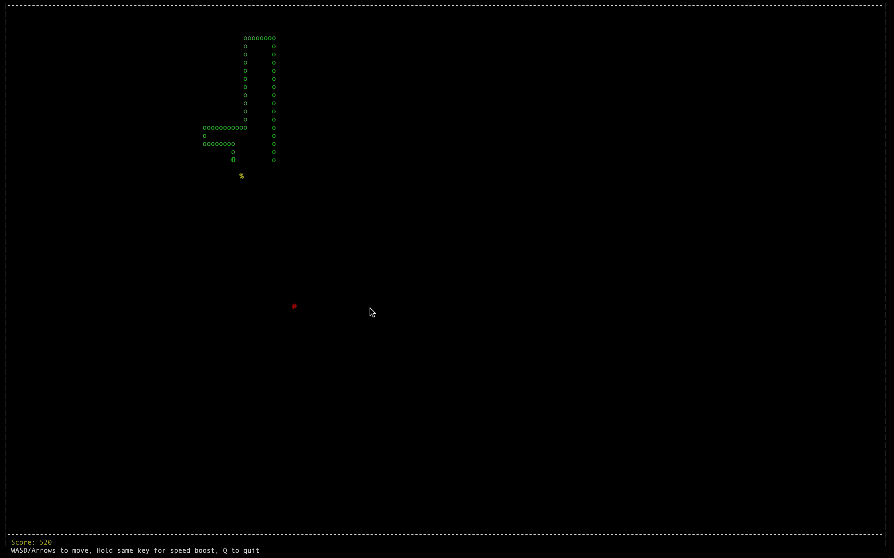
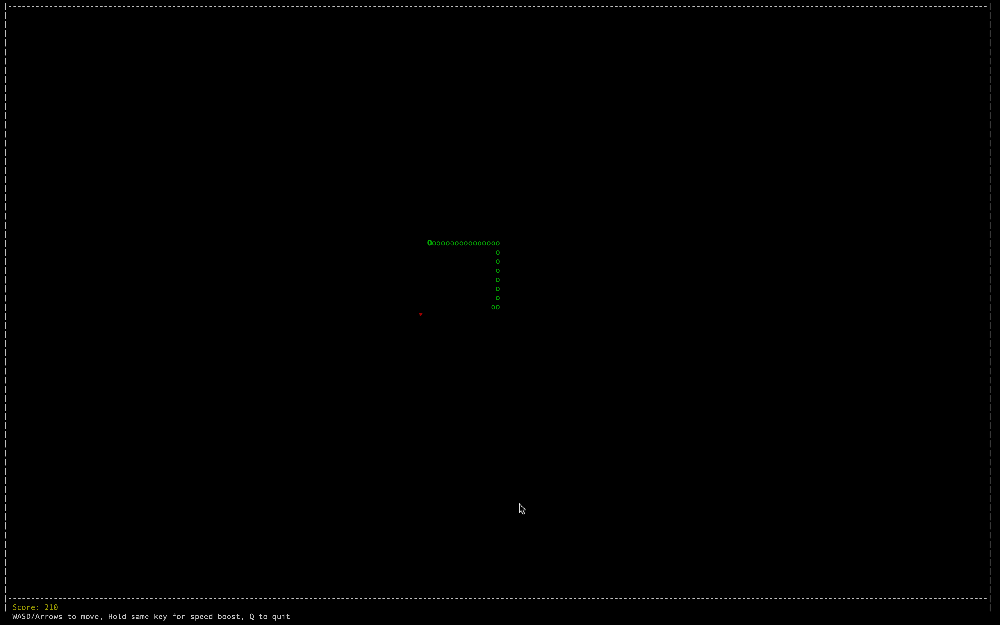
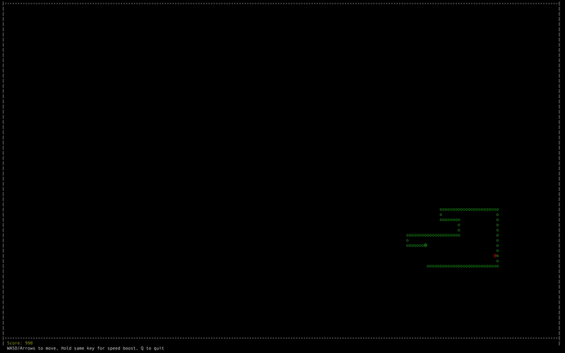

# 🐍 Terminal Snake Game

A **classic Snake game** recreated in Python, running entirely inside your terminal!  
Built using the `curses` library for real-time rendering and controls — no graphics libraries required.  

---

## ✨ Features
- 🎮 Smooth snake movement with real-time keyboard input  
- ⚡ Speed boost & Super food for challenging gameplay   
- 🛡 Wall & self-collision detection  
- 🔄 Instant restart after game over  
- 🖥 ️ Minimal CPU and memory usage  

---

## 📸 Screenshots
<p align="center">
  
  
</p>

---

## 🎥 Gameplay Preview
<p align="center">
  
</p>

---

## 🚀 How to Run
```bash
# Clone the repository
git clone https://github.com/YourUsername/terminal-snake-py.git

# Navigate into the folder
cd terminal-snake-py

# Run the game
python3 snake_game.py

---

## 🛠 Tech Stack

- Language: Python 3.10+
- Libraries:
  - `curses` – Terminal rendering & keyboard input
  - `random` – Random food placement
  - `collections.deque` – Efficient snake body management
- Platform: Terminal-based (macOS, Linux, WSL)
- Tools Used: zsh, command-line, macOS Terminal

---
